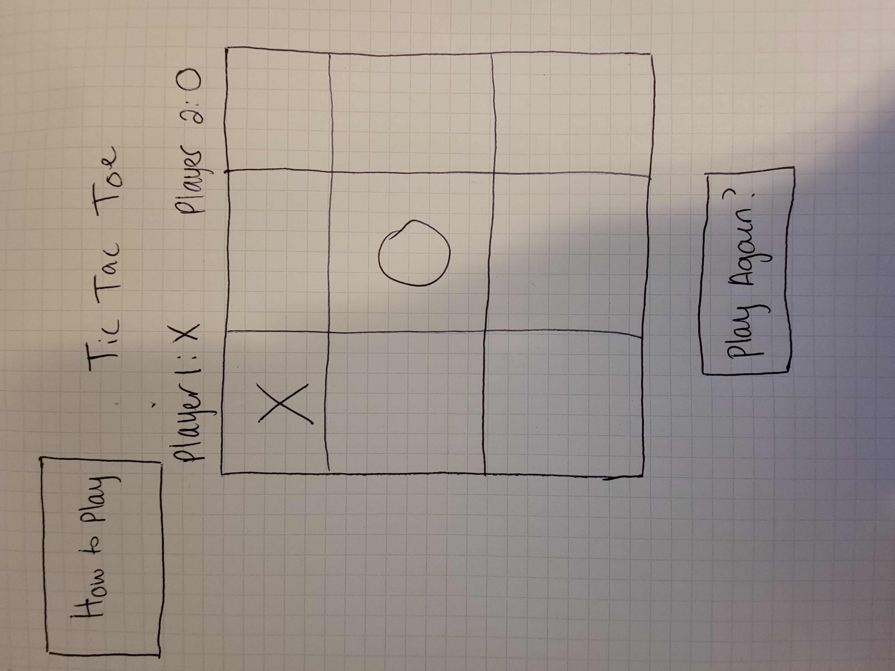

# Tic Tac Toe

## Description

A browser-based Tic Tac Toe game coded in Javascript, HTML and CSS.

## Planning Process

## User Stories

#### MVP

- As a user, I want a browser-based interface so that I can play the game.
- As a user, I want the game to reach a win state so that I know who won and can play again.
- As a user, I want the game to account for ties and be able to play again.
- As a user, I want to place my token so that I can interact with the game.
- As a user, I want an opponent to play against (human opponent as player 2).
- As a user, I want instructions on how to play.

#### Bronze

- As a user, I want the game to keep track of wins, ties and losses.
- As a user, I want to have a timer for my game so I know how long I've been laying.

#### Silver

- As a user, I want an opponenet to play against (computer opponent as player 2).

#### Gold

- As a user, I want to be able to upload my own image as my token so that I can customize the game.
- As a user, I want to be able to pick a theme for my game's style so that the icons and board all match (underwater, western, holiday).
- As a user, I want my game to have audio and sound effects when an action happens.
- As a user, I want to have different board sizes for my game.

### Wireframs

